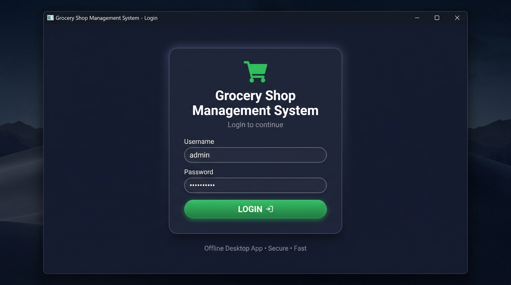
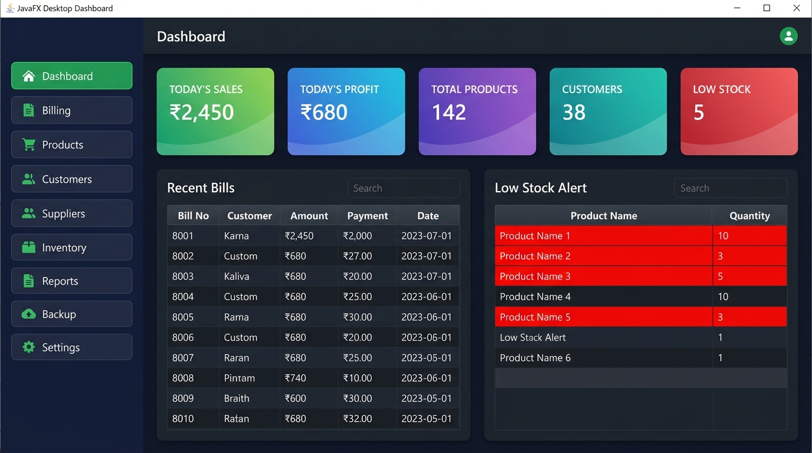
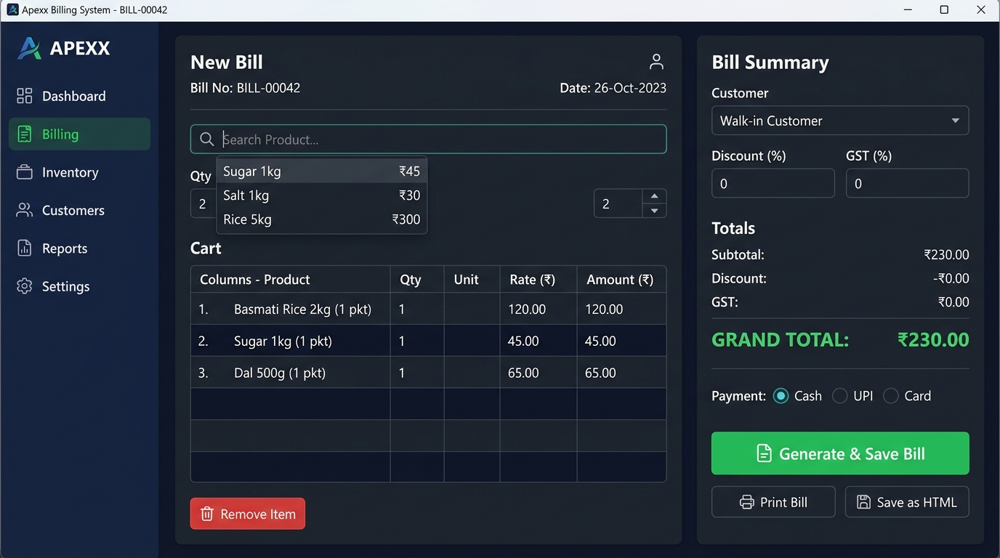
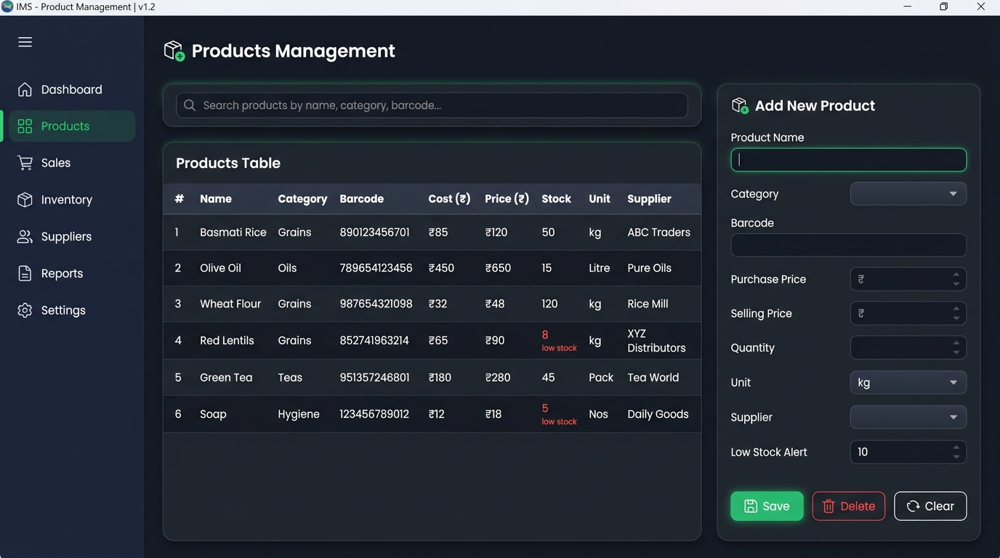
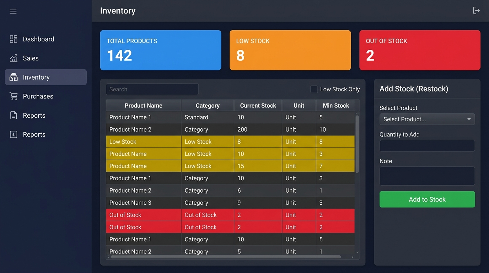
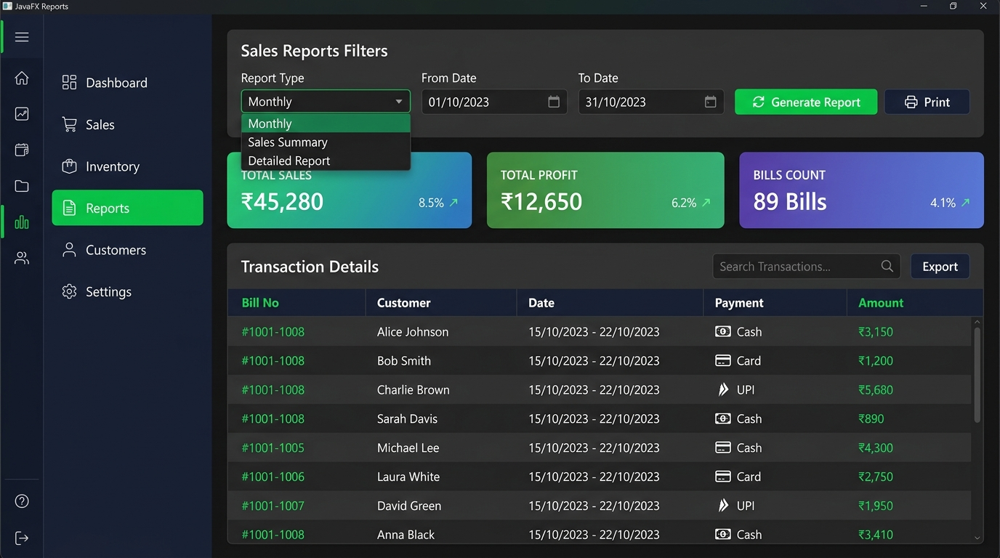
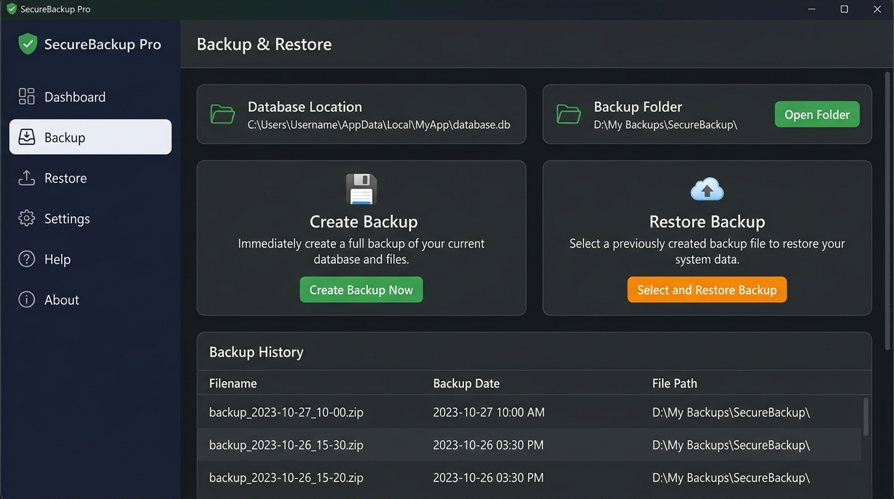

# 🛒 Grocery Shop Management System

A professional, lightweight **offline desktop application** for small grocery shop owners.  
Built with **JavaFX 21 + SQLite** — no internet, no installation hassle, no technical knowledge required.

---

## 📸 Screenshots

### 🔐 Login Screen


### 🏠 Dashboard


### 🧾 Billing


### 📦 Products Management


### 🏪 Inventory Management


### 📊 Reports


### 💾 Backup & Restore


---

## ✨ Features

| Module | Features |
|--------|----------|
| 🏠 **Dashboard** | Today's sales, profit, low stock alerts, recent bills |
| 🧾 **Billing** | Fast product search, cart, print invoice, PDF save |
| 📦 **Products** | Add/Edit/Delete products, barcode, low stock alert |
| 👥 **Customers** | Customer management, purchase history |
| 🚚 **Suppliers** | Supplier management, supplied products list |
| 🏪 **Inventory** | Stock tracking, restock, low stock filter |
| 📊 **Reports** | Daily/Weekly/Monthly/Yearly sales & profit reports |
| 💾 **Backup** | One-click backup & restore database |
| ⚙️ **Settings** | Shop name, GST, currency, change password |

---

## 🛠️ Technology Stack

- **Frontend:** JavaFX 21 (FXML + CSS)
- **Backend:** Java 21
- **Database:** SQLite (embedded — no server needed)
- **Build Tool:** Apache Maven

---

## 🚀 Getting Started

### Prerequisites
- Java 21 or higher
- Maven 3.6+

### Run the App

```bash
git clone https://github.com/somnath297/GroceryShopManagement.git
cd GroceryShopManagement
mvn javafx:run
```

### Default Login Credentials
```
Username: admin
Password: admin123
```

---

## 📦 Building for Deployment

### Portable (No Installation Required)
```bash
mvn clean package
build-portable.bat
```
Output: `portable/GroceryShop/GroceryShop.exe`

### Windows Installer (.exe)
```bash
mvn clean package
build-installer.bat
```
Output: `installer/GroceryShop-1.0.0.exe`

---

## 📁 Project Structure

```
GroceryShopManagement/
├── src/main/java/com/grocery/
│   ├── app/                  # Main application entry point
│   ├── controller/           # JavaFX controllers (11 modules)
│   ├── dao/                  # Data Access Objects (SQLite queries)
│   ├── model/                # Data models (Bill, Product, Customer...)
│   ├── service/              # Business logic layer
│   └── util/                 # Utilities (Print, Alert, Currency...)
├── src/main/resources/
│   ├── fxml/                 # 11 FXML layout files
│   └── css/                  # main.css (dark theme)
├── screenshots/              # App screenshots
├── pom.xml                   # Maven configuration
├── run.bat                   # Quick run script
├── build-portable.bat        # Build portable EXE
└── build-installer.bat       # Build Windows installer
```

---

## 💡 Key Highlights

- ✅ **Fully Offline** — works without internet
- ✅ **No Setup Needed** — database auto-creates on first run
- ✅ **Print Invoices** — physical printer + PDF support
- ✅ **Auto Stock Update** — billing auto-deducts inventory
- ✅ **Live Search** — search in every module
- ✅ **Dark Theme UI** — modern and easy on eyes
- ✅ **Backup & Restore** — never lose your data

---

## 📄 License

This project is licensed under the MIT License.

---

## 👨‍💻 Developer

Made with ❤️ for small village grocery shop owners.  
**GitHub:** [@somnath297](https://github.com/somnath297)
